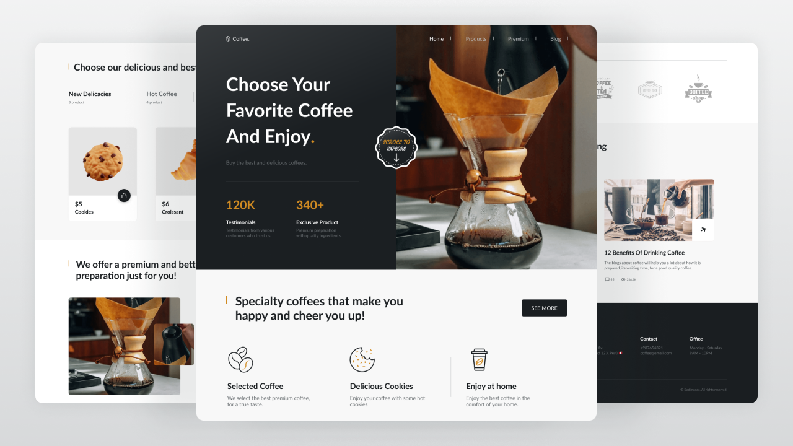

# ☕ Website Responsivo de Café

### 🔗 [Acesse o site no GitHub Pages clicando aqui](https://balenaV.github.io/responsive-coffee-website/)

---

## ☕ Website Responsivo de Café

- Website responsivo criado com **HTML, CSS e JavaScript**.
- Rolagem suave entre as seções.
- Desenvolvido com a metodologia **Mobile First**, depois adaptado para desktop.
- Compatível com todos os dispositivos móveis, com uma interface **bonita e agradável**.
- Utiliza **filtros dinâmicos com `data-filter`** para exibir produtos por categoria.
- Ícones via **Remix Icon**, fontes importadas do **Google Fonts**.

---

